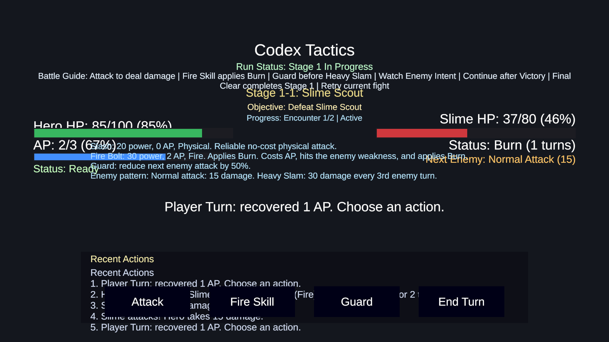
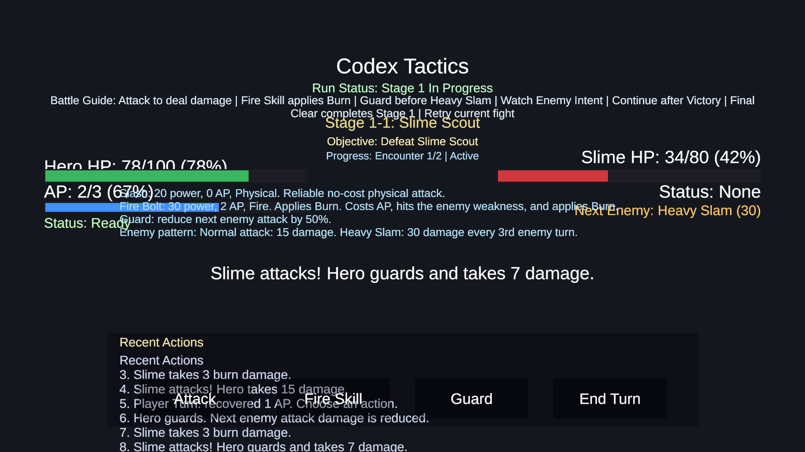
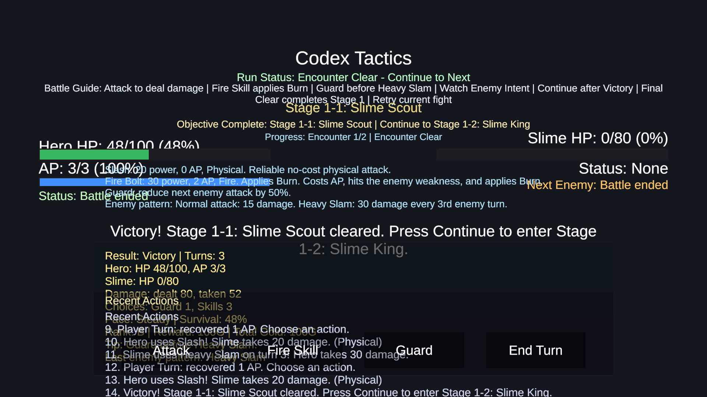
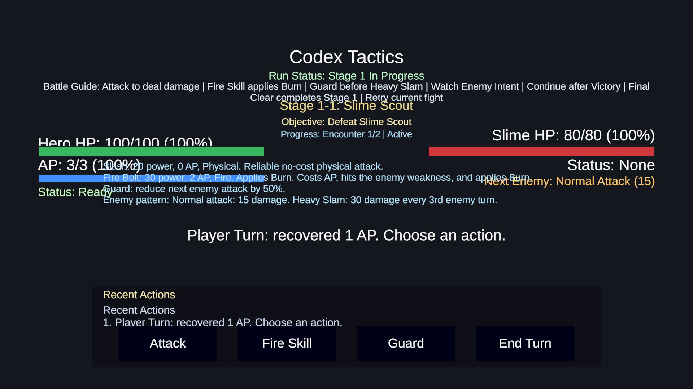

# GamePortfolio — 2D Turn-Based RPG Prototype

> **A learn-by-building portfolio project**: A small, playable 2D turn-based battle system built in Unity, demonstrating data-driven design, clean code practices, and thorough documentation.


---

## What This Project Shows

### 🎮 Gameplay (Vertical Slice)

A single stage with two encounters: a normal **Slime Scout** followed by a **Slime King** boss. The player chooses from four actions each turn:

- **Attack** — free physical damage
- **Fire Skill (Fire Bolt)** — costs AP, deals fire damage, applies Burn (damage-over-time)
- **Guard** — reduces next enemy attack by 50%
- **End Turn** — skip to recover AP faster

The enemy has an intent system (previewing its next attack), a pattern-based AI (Heavy Slam every 3rd turn), and elemental weakness mechanics. Victory ranks (S/A/B/C) scale rewards and provide feedback.




### 🏗️ Architecture

The project separates concerns into three layers:

| Layer | Scripts | Purpose |
|-------|---------|---------|
| **Battle Flow** | `BattleManager` | State machine, turns, damage, UI updates |
| **Results** | `BattleResultData` + `Evaluator` + `Presenter` | Metrics collection, rank/tip rules, display formatting |
| **Data** | `CharacterData`, `SkillData`, `StageData`, `EnemyPatternData`, `BattleBalanceConfig` (ScriptableObject) | All configurable values — no magic numbers in battle logic |



### 🧪 Testing & Validation

- **Scene auto-builder**: Regenerates the battle test scene from code (`BattleSceneAutoBuilder.cs`)
- **Auto test runner**: Runs battle logic through all states (`BattleAutoTestRunner.cs`)
- **Manual validation checklist**: Step-by-step Unity verification guide
- **Balance table**: Documented design intent for HP, damage, and rank thresholds

### 📝 Documentation Culture

Every feature is paired with two documents:
- **Devlog** — what was done and how
- **Study Note** — what was learned and why

This practice makes the project a genuine portfolio of growth, not just a feature list.

---

## Quick Start

1. Open the project in Unity Hub
2. `Tools > Codex Tactics > Create Battle Test Scene`
3. Press **Play**
4. Try Attack → Fire Skill → Guard to experience the full loop



---

## Project Layout

```
Assets/
├── Scripts/
│   ├── Battle/
│   │   ├── BattleManager.cs        — Core battle loop (state machine)
│   │   ├── BattleResultData.cs     — Result value container
│   │   ├── BattleResultEvaluator.cs— Rank/pace/reward rules
│   │   ├── BattleResultPresenter.cs— Result display formatting
│   │   └── BattleState.cs          — State enum
│   └── Data/
│       ├── BattleBalanceConfig.cs  — ScriptableObject (all tuning values)
│       ├── CharacterData.cs        — Player/enemy stats
│       ├── SkillData.cs            — Skill definitions
│       ├── StageData.cs            — Encounter configurations
│       ├── EnemyData.cs            — Enemy definitions
│       └── EnemyPatternData.cs     — Enemy AI patterns
├── Editor/
│   ├── BattleSceneAutoBuilder.cs   — Test scene generator
│   ├── BattleAutoTestRunner.cs     — Battle logic auto tester
│   └── CreateBalanceConfigAsset.cs — Config asset creator
Docs/
├── Captures/                       — Screenshots & GIFs
├── Devlog/                         — Per-feature dev notes
├── Study/                          — Per-feature learning notes
├── BalanceTable.md                 — Tuning rationale
└── PortfolioShowcaseDraft.md       — Portfolio narrative draft
```

---

## Key Technical Decisions

| Decision | Rationale |
|----------|-----------|
| **ScriptableObject balance config** | All tuning values in one Inspector-editable asset; zero hardcoded magic numbers in battle code |
| **Separate Result Data/Evaluator/Presenter** | Prevents result logic from bloating BattleManager; each class has one responsibility |
| **Data-driven enemies & stages** | Adding a new encounter = adding a ScriptableObject asset, no code changes |
| **Editor automation** | Test scene and auto-tester enable rapid iteration without manual setup |

---

## Roadmap (Planned)

- [x] Core battle loop (attack, skill, guard)
- [x] Stage encounters (normal → boss)
- [x] Result system (ranks, rewards, tips)
- [x] Balance config as ScriptableObject
- [ ] Capture screenshots/GIFs for README
- [ ] BattleManager refactor (split UI/logic/state)
- [ ] Multiple enemy encounters per stage
- [ ] Simple title screen
- [ ] Shop / inventory system

---

## Tech Stack

- **Engine**: Unity 6000.4.6f1 (URP)
- **Language**: C#
- **UI**: TextMeshPro + uGUI
- **Testing**: Editor script-based auto-tests

---

## License

MIT — free to use as a learning reference or portfolio template.
